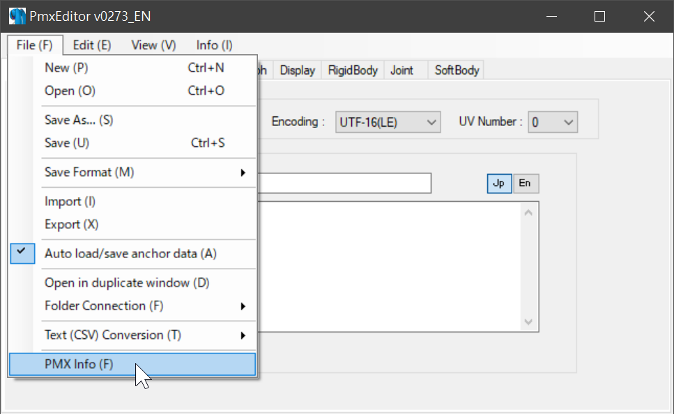
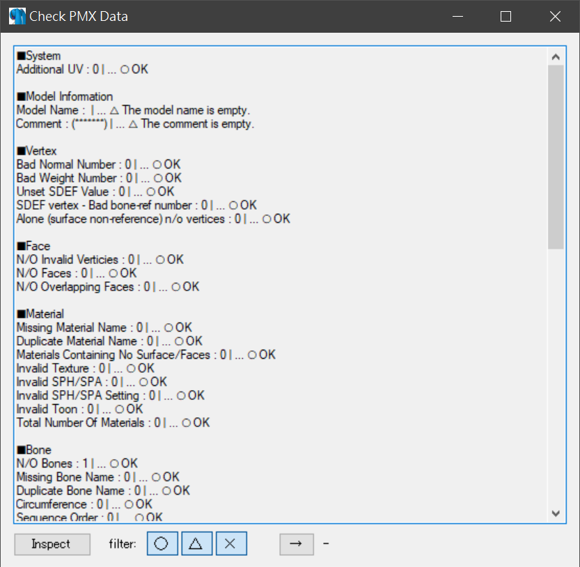
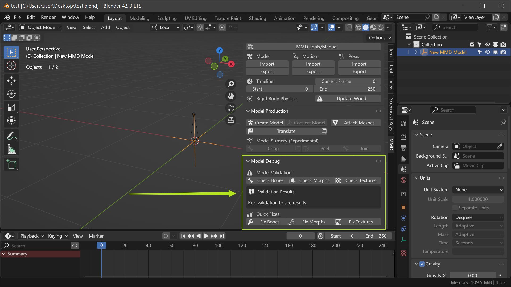
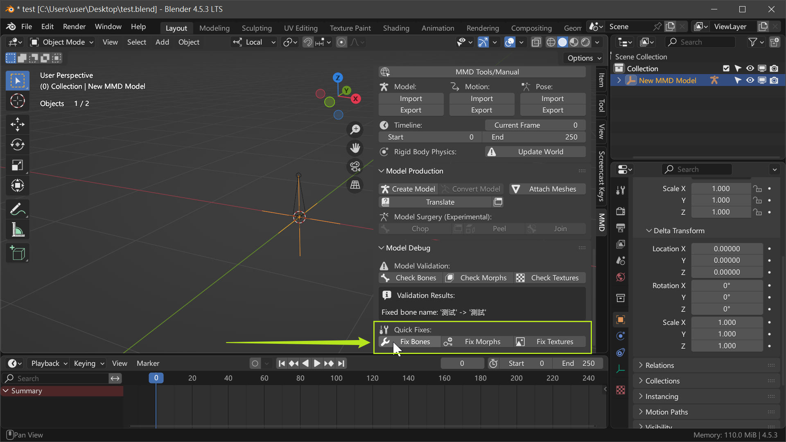
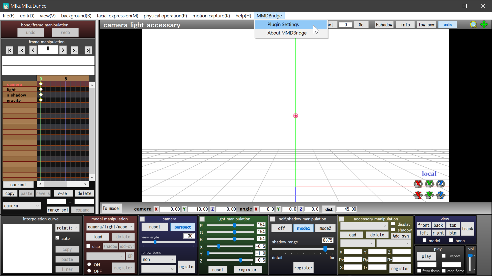
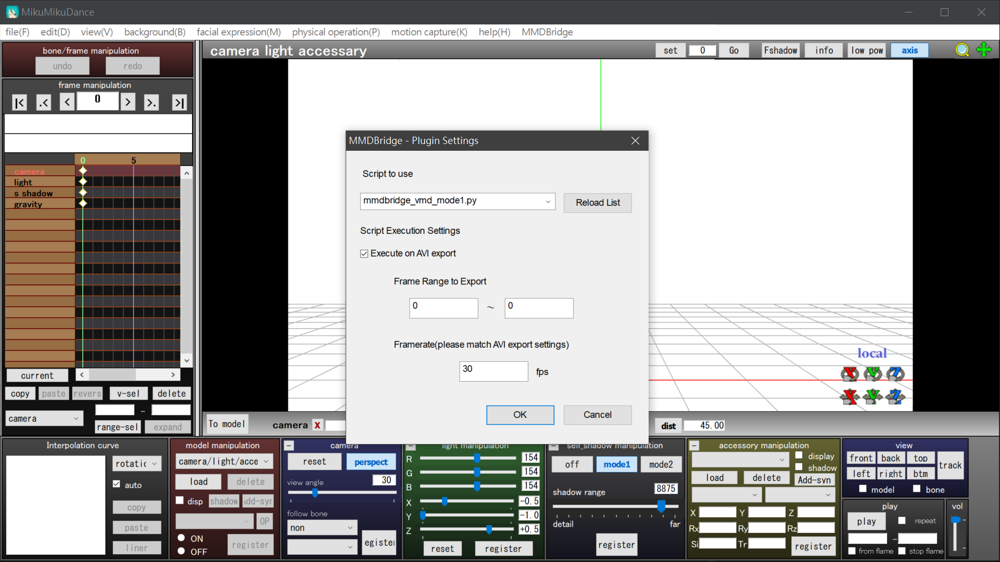
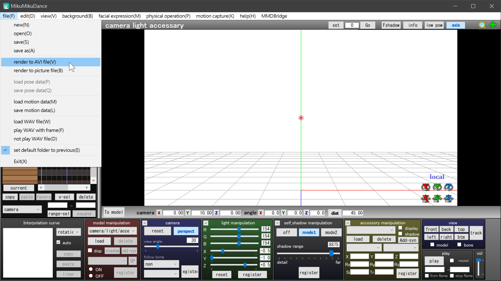
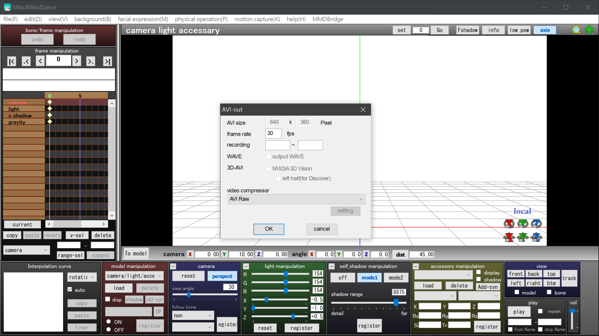
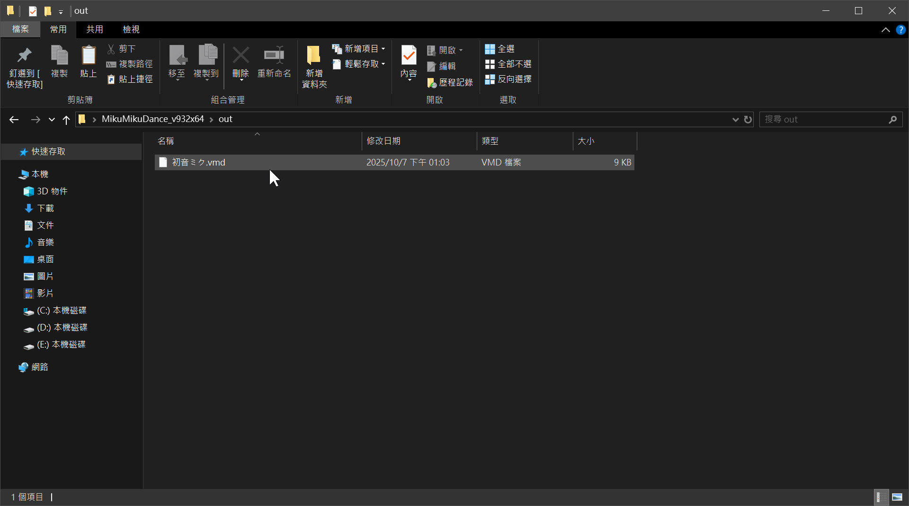

# How to Use

Before you begin, make sure to **check your model using both PMXEditor and MMD Tools**. Each detects different types of issues, and skipping either may cause unexpected problems that are hard to debug.

Open MMD and click on MMDBridge in the top menu to open the Plugin Settings panel.

The Python script will execute when render to AVI file.

After exporting, the files will be located in the "out" folder.

